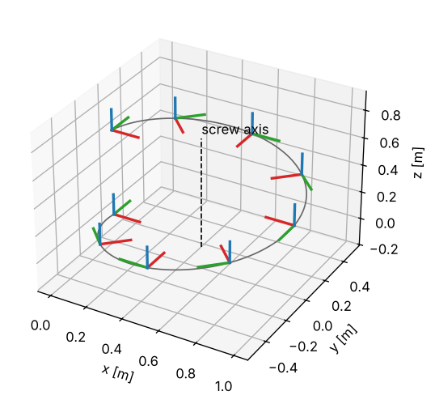

# 1 · Rigid-body transforms

Every quantity in this module — where a link is, how fast the hand moves, what error a controller drives to zero —
is a statement about frames attached to rigid bodies. This chapter fixes the tools for those statements:
rotation matrices, homogeneous transforms and twists, with the exponential map that connects a velocity to the
motion it produces. It is brief on purpose; Lynch & Park [2, ch. 3] and Murray, Li & Sastry [3, ch. 2] give the
full treatment. Symbols are collected in [00_notation.md](00_notation.md).

## 1.1 Rotations

The orientation of a frame $\{b\}$ relative to a frame $\{a\}$ is the matrix whose columns are the unit axes of
$\{b\}$ written in $\{a\}$:

$$
{}^{a}R_{b} = \begin{bmatrix} {}^{a}x_{b} & {}^{a}y_{b} & {}^{a}z_{b} \end{bmatrix}. \tag{1.1}
$$

Because the columns are orthonormal and right-handed, $R^T R = I$ and $\det R = +1$. These matrices form the
special orthogonal group $SO(3)$. The same matrix has three readings: the orientation of $\{b\}$ in $\{a\}$;
the change of coordinates ${}^{a}u = {}^{a}R_{b}\,{}^{b}u$ of a vector $u$; and an operator that rotates a vector
inside one frame.

Rotations about the coordinate axes by an angle $\theta$ are

$$
R_x(\theta) = \begin{bmatrix} 1 & 0 & 0 \\ 0 & c_\theta & -s_\theta \\ 0 & s_\theta & c_\theta \end{bmatrix},\quad
R_y(\theta) = \begin{bmatrix} c_\theta & 0 & s_\theta \\ 0 & 1 & 0 \\ -s_\theta & 0 & c_\theta \end{bmatrix},\quad
R_z(\theta) = \begin{bmatrix} c_\theta & -s_\theta & 0 \\ s_\theta & c_\theta & 0 \\ 0 & 0 & 1 \end{bmatrix},
\tag{1.2}
$$

with $c_\theta = \cos\theta$, $s_\theta = \sin\theta$.

**Composition.** Orientations chain by multiplication, inner indices cancelling:
${}^{a}R_{c} = {}^{a}R_{b}\,{}^{b}R_{c}$. Multiplying a new rotation on the *right* rotates about the axes of the
current (moving) frame; multiplying on the *left* rotates about the axes of the fixed frame. Rotations do not
commute, so the order matters.

**Skew-symmetric matrices.** For $\omega = (\omega_1, \omega_2, \omega_3)$ define

$$
[\omega]_\times = \begin{bmatrix} 0 & -\omega_3 & \omega_2 \\ \omega_3 & 0 & -\omega_1 \\ -\omega_2 & \omega_1 & 0 \end{bmatrix},
\qquad [\omega]_\times u = \omega \times u. \tag{1.3}
$$

**Angular velocity.** Differentiating $R R^T = I$ gives $\dot R R^T + R \dot R^T = 0$, so $\dot R R^T$ is
skew-symmetric. The vector it represents is the angular velocity of the frame, expressed in the fixed frame:

$$
\dot R = [\omega]_\times R. \tag{1.4}
$$

### Exponential coordinates

Equation (1.4) with constant $\omega$ is a linear ODE whose solution is $R(t) = e^{[\omega]_\times t} R(0)$. A
rotation by an angle $\theta$ about a unit axis $\hat\omega$ is therefore the matrix exponential
$\exp([\hat\omega]_\times \theta)$. The series collapses because a unit skew matrix satisfies
$[\hat\omega]_\times^3 = -[\hat\omega]_\times$: grouping odd and even powers gives the series of $\sin\theta$ and
$1 - \cos\theta$, which is **Rodrigues' formula**

$$
\exp([\hat\omega]_\times\theta) = I + \sin\theta\,[\hat\omega]_\times + (1 - \cos\theta)\,[\hat\omega]_\times^2.
\tag{1.5}
$$

The vector $\omega\theta \in \mathbb{R}^3$ (axis times angle) is a minimal, singularity-free description of a
rotation near the identity. Its inverse, the **logarithm**, follows from the trace and the skew part of (1.5):

$$
\theta = \arccos\frac{\operatorname{tr} R - 1}{2} \in [0, \pi], \qquad
[\hat\omega]_\times = \frac{R - R^T}{2\sin\theta}. \tag{1.6}
$$

Two cases need care. At $\theta = 0$ the axis is undefined and $\log R = 0$. At $\theta = \pi$ the skew part
vanishes and gives no direction. The symmetric part of (1.5) still does: since
$[\hat\omega]_\times^2 = \hat\omega\hat\omega^T - I$,

$$
\hat\omega\hat\omega^T = \frac{\tfrac12 (R + R^T) - \cos\theta\, I}{1 - \cos\theta}, \tag{1.6a}
$$

so $\hat\omega$ is read from a non-zero column of the right-hand side. At exactly $\theta = \pi$ the sign of
$\hat\omega$ is free, because $\pm\hat\omega\pi$ describe the same rotation.

### Roll, pitch, yaw

Many interfaces describe orientation with three angles. This module uses the ZYX convention (yaw $\psi$ about
$z$, then pitch $\vartheta$ about the new $y$, then roll $\phi$ about the newest $x$):

$$
R = R_z(\psi)\,R_y(\vartheta)\,R_x(\phi). \tag{1.7}
$$

Reading the entries of (1.7) gives the inverse map
$\vartheta = \operatorname{atan2}\!\big(-r_{31}, \sqrt{r_{11}^2 + r_{21}^2}\big)$,
$\psi = \operatorname{atan2}(r_{21}, r_{11})$, $\phi = \operatorname{atan2}(r_{32}, r_{33})$.
At $\vartheta = \pm\pi/2$ the first and last rotation axes line up and only $\psi \mp \phi$ is determined — the
**representation singularity** (gimbal lock). It is a property of the three-angle chart, not of the rotation,
and it reappears in chapter 3 as a singularity of the analytic Jacobian.

## 1.2 Homogeneous transforms

The pose of $\{b\}$ in $\{a\}$ joins orientation and position into one $4\times 4$ matrix

$$
{}^{a}T_{b} = \begin{bmatrix} {}^{a}R_{b} & {}^{a}p_{b} \\ 0 & 1 \end{bmatrix} \in SE(3). \tag{1.8}
$$

A point with coordinates ${}^{b}x$ has coordinates
$\begin{bmatrix}{}^{a}x \\ 1\end{bmatrix} = {}^{a}T_{b} \begin{bmatrix}{}^{b}x \\ 1\end{bmatrix}$ in $\{a\}$, and
poses chain like rotations: ${}^{a}T_{c} = {}^{a}T_{b}\,{}^{b}T_{c}$. The inverse never needs a general matrix
inversion:

$$
T^{-1} = \begin{bmatrix} R^T & -R^T p \\ 0 & 1 \end{bmatrix}. \tag{1.9}
$$

## 1.3 Twists

The velocity of a rigid body is not a pair of unrelated vectors; it is one object, the **twist**. Differentiate
$T(t)$ and multiply by $T^{-1}$:

$$
\dot T T^{-1} = \begin{bmatrix} \dot R R^T & \dot p - \dot R R^T p \\ 0 & 0 \end{bmatrix}
= \begin{bmatrix} [\omega]_\times & v \\ 0 & 0 \end{bmatrix} = [\mathcal{V}],
\qquad \mathcal{V} = \begin{bmatrix} v \\ \omega \end{bmatrix}. \tag{1.10}
$$

$\omega$ is the angular velocity from (1.4). $v = \dot p - \omega \times p$ is the velocity of the (imaginary)
point of the body that is passing through the origin of the fixed frame. This is the *spatial* twist; the
*body* twist $T^{-1}\dot T$ is the same velocity expressed in the moving frame. This module always lists the
linear part first, the order used by the Jacobian rows in Siciliano et al. [1] and by Pinocchio; Lynch & Park [2]
put $\omega$ first.

**Changing frames.** If a twist is $\mathcal{V}_b$ in frame $\{b\}$ and ${}^{a}T_{b} = (R, p)$, then
$[\mathcal{V}_a] = {}^{a}T_{b}[\mathcal{V}_b]\,{}^{a}T_{b}^{-1}$. Expanding the product gives a linear map, the
**adjoint**:

$$
\mathcal{V}_a = \mathrm{Ad}_{{}^{a}T_{b}}\,\mathcal{V}_b, \qquad
\mathrm{Ad}_T = \begin{bmatrix} R & [p]_\times R \\ 0 & R \end{bmatrix}. \tag{1.11}
$$

### Screw motion and the exponential on SE(3)

Chasles' theorem says every rigid displacement is a rotation about some line combined with a translation along
it — a screw motion. Let the line pass through a point $q$ with unit direction $\hat\omega$, and let the body
advance $h$ (the pitch) per radian. The screw axis is the twist of unit rotation speed:

$$
\mathcal{S} = \begin{bmatrix} -\hat\omega \times q + h\hat\omega \\ \hat\omega \end{bmatrix}. \tag{1.12}
$$

A pure translation along a unit direction $\hat v$ is the limit $\mathcal{S} = (\hat v, 0)$. Turning by $\theta$
about $\mathcal{S}$ is the solution of $\dot T = [\mathcal{S}] T$, i.e. the exponential. Summing the series with
the help of $[\hat\omega]_\times^3 = -[\hat\omega]_\times$ again gives a closed form [2, eq. 3.88]:

$$
\exp([\mathcal{S}]\theta) = \begin{bmatrix} e^{[\hat\omega]_\times\theta} & G(\theta)\,v \\ 0 & 1 \end{bmatrix},
\qquad
G(\theta) = I\theta + (1 - \cos\theta)[\hat\omega]_\times + (\theta - \sin\theta)[\hat\omega]_\times^2. \tag{1.13}
$$

The code takes the product $\xi = \mathcal{S}\theta = (v\theta, \hat\omega\theta)$ as a single six-vector, the
exponential coordinates of the displacement; then $\theta = \lVert\omega\rVert$ and (1.13) is evaluated with
$\hat\omega = \omega/\theta$. For small $\theta$ the coefficients $\sin\theta/\theta$, $(1-\cos\theta)/\theta^2$
and $(\theta - \sin\theta)/\theta^3$ are replaced by their Taylor series to avoid dividing zero by zero.
(1.13) also covers pure translation: with $\hat\omega\theta = 0$ it reduces to $R = I$, $p = v\theta$.

**Worked example.** A quarter turn about the vertical line through $q = (1, 0, 0)$, with zero pitch:
$\hat\omega = (0,0,1)$, $\theta = \pi/2$, $v = -\hat\omega \times q = (0, -1, 0)$. Equation (1.13) gives
$R = R_z(\pi/2)$ and translation $(I - R)q = (1, -1, 0)$: the point $q$ stays put and the origin swings to
$(1, -1, 0)$. This example is a unit test (`cpp/tests/test_transforms.cpp`).

The logarithm inverts (1.13): take $\omega\theta = \log R$ from (1.6), then

$$
v\theta = \Big(I - \tfrac{1}{2}[\omega\theta]_\times
+ \Big(1 - \frac{\theta\sin\theta}{2(1 - \cos\theta)}\Big)\frac{[\omega\theta]_\times^2}{\theta^2}\Big)\,p, \tag{1.14}
$$

*Figure 1.1 — Frames $\exp([\mathcal{S}]\theta)$ for $\theta \in [0, 2\pi]$ about a vertical screw axis through
$q = (0.5, 0, 0)$ with pitch $h = 0.1$. The origin traces a helix around the axis. Generated by
`tools/make_figures.py`.*

## 1.4 Algorithms

**Exponential on SE(3)** (`exp_se3`, eq. 1.13) — input $\xi = (\nu, \varphi) \in \mathbb{R}^6$, the exponential
coordinates ($\nu = v\theta$, $\varphi = \hat\omega\theta$):

1. $\theta \leftarrow \lVert\varphi\rVert$, $W \leftarrow [\varphi]_\times$.
2. Compute $a = \sin\theta/\theta$, $b = (1-\cos\theta)/\theta^2$, $c = (\theta - \sin\theta)/\theta^3$, using
   Taylor series when $\theta$ is below $10^{-4}$.
3. $R \leftarrow I + aW + bW^2$ (Rodrigues, 1.5, with the angle folded into $W$).
4. $p \leftarrow (I + bW + cW^2)\,\nu$ (eq. 1.13 with the angle folded in).
5. Return $\begin{bmatrix} R & p \\ 0 & 1\end{bmatrix}$.

**Logarithm on SO(3)** (`log_so3`, eqs. 1.6, 1.6a) — input $R$:

1. $\theta \leftarrow \operatorname{atan2}\big(\lVert (R - R^T)^\vee \rVert / 2,\ (\operatorname{tr}R - 1)/2\big)$. This is (1.6)
   rewritten with both $\sin\theta$ and $\cos\theta$: $\arccos$ alone amplifies rounding near $\theta = \pi$.
2. If $\theta < 10^{-8}$: return $\tfrac12 (R - R^T)^\vee$ (first-order term).
3. If $\theta > 3\pi/4$: take the column $j$ of $B$, the right-hand side of (1.6a), with the largest
   diagonal entry,
   $\hat\omega = B_{:,j}/\sqrt{B_{jj}}$, choose its sign to agree with $(R - R^T)^\vee$, and return
   $\hat\omega\theta$.
4. Otherwise return $\dfrac{\theta}{2\sin\theta}(R - R^T)^\vee$.

The switch in step 3 is made well before $\pi$: the relative error of step 4 grows like
$\varepsilon/\sin\theta$ (with $\varepsilon$ the rounding error of $R$), whereas (1.6a) divides by
$1 - \cos\theta \ge 1.7$ on that interval.

## 1.5 Common mistakes

- **Mixing twist orderings.** $(v, \omega)$ and $(\omega, v)$ are both common. Copying a formula for the adjoint
  or the Jacobian from a book that uses the other order silently swaps blocks.
- **Composing in the wrong order.** ${}^{a}T_{b}\,{}^{b}T_{c}$ is correct; ${}^{b}T_{c}\,{}^{a}T_{b}$ multiplies
  frames that do not share an index. Write the indices and let them cancel.
- **Integrating rotations additively.** $R_{k+1} = R_k + \Delta t\,[\omega]_\times R_k$ leaves $SO(3)$ after a
  few steps (the determinant drifts). Use $R_{k+1} = \exp([\omega]_\times\Delta t) R_k$. The chapter-1 notebook
  shows the drift.
- **`atan` instead of `atan2`.** The one-argument arctangent loses the quadrant.
- **Trusting Euler angles near the singularity.** Near $\vartheta = \pm\pi/2$, small changes of orientation give
  large jumps in $\phi$ and $\psi$.
- **Using (1.6) at $\theta = \pi$.** Division by $\sin\theta = 0$; use the special case.

## References

1. B. Siciliano, L. Sciavicco, L. Villani, G. Oriolo, *Robotics: Modelling, Planning and Control*, Springer,
   2009, ch. 2.
2. K. M. Lynch, F. C. Park, *Modern Robotics: Mechanics, Planning, and Control*, Cambridge University Press,
   2017, ch. 3.
3. R. M. Murray, Z. Li, S. S. Sastry, *A Mathematical Introduction to Robotic Manipulation*, CRC Press, 1994,
   ch. 2.
4. J. Solà, J. Deray, D. Atchuthan, *A micro Lie theory for state estimation in robotics*, arXiv:1812.01537,
   2018.
5. R. S. Ball, *A Treatise on the Theory of Screws*, Cambridge University Press, 1900.
