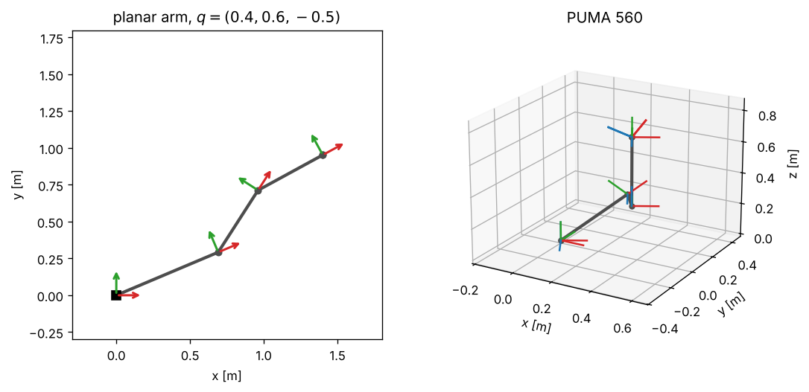

# 2 · Forward kinematics

Forward kinematics answers one question: given the joint values $q$, where is every link, and in particular the
end-effector? For a serial arm the answer is a product of transforms, one per joint. There are two standard
ways to write those transforms. The **Denavit–Hartenberg (DH)** convention attaches a frame to every link and
describes each link with four numbers [1]. The **product of exponentials (POE)** describes each joint by its
screw axis in a single frame and needs no link frames at all [3, 4]. This chapter derives both, writes the same
arm both ways, and proves that they agree. Notation: [00_notation.md](00_notation.md); transforms and screws:
[chapter 1](01_rigid_body_transforms.md).

## 2.1 Serial chains

A serial chain is a sequence of $n + 1$ rigid links connected by $n$ one-degree-of-freedom joints. Link $0$ is
the base, link $n$ carries the end-effector. Joint $i$ connects link $i-1$ to link $i$ and is either
**revolute** (variable $q_i$ is an angle) or **prismatic** (variable $q_i$ is a length). The joint vector
$q = (q_1, \dots, q_n)$ lives in the configuration space; forward kinematics is the map

$$
q \mapsto T_e(q) \in SE(3).
$$

## 2.2 The Denavit–Hartenberg convention

Attach frame $\{i\}$ to link $i$ by the following rules (standard, or *distal*, DH as in Siciliano et al.
[2, sec. 2.8]):

1. $z_{i-1}$ lies along the axis of joint $i$.
2. $x_i$ lies along the common normal of $z_{i-1}$ and $z_i$, pointing from joint $i$ to joint $i+1$; its
   intersection with $z_i$ is the origin $o_i$. (If the axes intersect, $x_i$ is normal to both; if they are
   parallel, any common normal may be chosen.)
3. $y_i$ completes a right-handed frame.

Four numbers then locate $\{i\}$ relative to $\{i-1\}$:

| parameter | meaning |
|---|---|
| $a_i$ | distance from $z_{i-1}$ to $z_i$ along $x_i$ |
| $\alpha_i$ | angle from $z_{i-1}$ to $z_i$ about $x_i$ |
| $d_i$ | distance from $x_{i-1}$ to $x_i$ along $z_{i-1}$ |
| $\theta_i$ | angle from $x_{i-1}$ to $x_i$ about $z_{i-1}$ |

Going from $\{i-1\}$ to $\{i\}$ is four elementary motions, each about or along an axis of the frame reached so
far: translate by $d_i$ and rotate by $\theta_i$ about $z_{i-1}$, then translate by $a_i$ and rotate by
$\alpha_i$ about the new $x$. Motions about current axes multiply on the right (section 1.1), so

$$
{}^{i-1}T_{i} = R_z(\theta_i)\,T_z(d_i)\,T_x(a_i)\,R_x(\alpha_i) =
\begin{bmatrix}
c_{\theta_i} & -s_{\theta_i} c_{\alpha_i} & s_{\theta_i} s_{\alpha_i} & a_i c_{\theta_i} \\
s_{\theta_i} & c_{\theta_i} c_{\alpha_i} & -c_{\theta_i} s_{\alpha_i} & a_i s_{\theta_i} \\
0 & s_{\alpha_i} & c_{\alpha_i} & d_i \\
0 & 0 & 0 & 1
\end{bmatrix}. \tag{2.1}
$$

($R_z$ and $T_z$ commute, as do $T_x$ and $R_x$, so other orderings of each pair give the same matrix.) The joint
variable enters exactly one parameter: $\theta_i = q_i + \theta_i^0$ for a revolute joint, $d_i = q_i + d_i^0$
for a prismatic one, where $\theta_i^0$, $d_i^0$ are constant offsets from the table. Chaining the link transforms,
with an optional base transform $T_0$ (where the arm is mounted) and tool transform ${}^{n}T_{e}$, gives

$$
T_i(q) = T_0\,{}^{0}T_{1}(q_1)\cdots{}^{i-1}T_{i}(q_i), \qquad T_e(q) = T_n(q)\,{}^{n}T_{e}. \tag{2.2}
$$

`SerialChain::frames` returns the whole list $T_0, T_1, \dots, T_n, T_e$: it is needed again for the Jacobian in
chapter 3.

> **Modified DH.** Craig [5] attaches frame $\{i\}$ to the *proximal* end of link $i$, which gives
> ${}^{i-1}T_{i} = R_x(\alpha_{i-1})\,T_x(a_{i-1})\,R_z(\theta_i)\,T_z(d_i)$. Both conventions are correct; a DH table
> is meaningless unless you know which one it uses. The chapter-2 notebook shows what happens when they are mixed.

### Worked example: the planar two-link arm

Both joints rotate about axes parallel to $z_0$, and the links have lengths $l_1$, $l_2$:

| $i$ | $a_i$ | $\alpha_i$ | $d_i$ | $\theta_i$ |
|---|---|---|---|---|
| 1 | $l_1$ | 0 | 0 | $q_1$ |
| 2 | $l_2$ | 0 | 0 | $q_2$ |

Multiplying two matrices (2.1) with $\alpha_i = d_i = 0$ gives the familiar closed form

$$
p_e = \begin{bmatrix} l_1 c_1 + l_2 c_{12} \\ l_1 s_1 + l_2 s_{12} \\ 0 \end{bmatrix}, \qquad
R_e = R_z(q_1 + q_2), \tag{2.3}
$$

with $c_{12} = \cos(q_1 + q_2)$. The unit test `planar two-link arm matches the closed form` checks (2.3).

### Worked example: the PUMA 560 at its home configuration

The PUMA 560 in standard DH parameters, as tabulated by Corke [6] (lengths in metres):

| $i$ | $a_i$ | $\alpha_i$ | $d_i$ | $\theta_i$ |
|---|---|---|---|---|
| 1 | 0 | $\pi/2$ | 0 | $q_1$ |
| 2 | 0.4318 | 0 | 0 | $q_2$ |
| 3 | 0.0203 | $-\pi/2$ | 0.15005 | $q_3$ |
| 4 | 0 | $\pi/2$ | 0.4318 | $q_4$ |
| 5 | 0 | $-\pi/2$ | 0 | $q_5$ |
| 6 | 0 | 0 | 0 | $q_6$ |

At $q = 0$ the products are easy by hand. ${}^{0}T_{1} = R_x(\pi/2)$. Link 2 moves the origin by $a_2$ along
$x_1 = x_0$: $o_2 = (a_2, 0, 0)$. Link 3 adds $(a_3, 0, d_3)$ expressed in a frame rotated by $R_x(\pi/2)$, which maps
$z$ to $-y$: $o_3 = (a_2 + a_3, -d_3, 0)$, and the two twists cancel so $R_3 = I$. Link 4 adds $d_4$ along $z_3 = z_0$:
$o_4 = (a_2 + a_3, -d_3, d_4)$. Links 5 and 6 have no lengths and their twists cancel again. Hence the wrist centre
and end-effector are at $(a_2 + a_3, -d_3, d_4)$ with $R_e = I$; the unit test
`PUMA 560 home pose matches the hand computation` checks this.

*Figure 2.1 — DH frames $T_0, \dots, T_n$ (x red, y green, z blue). Left: planar three-link arm, every $z$ axis
points out of the page. Right: PUMA 560 at $q = (0.5, \pi/4, -\pi/4, 0, \pi/3, 0)$; each joint axis is the $z$ axis
of the previous frame. Generated by `tools/make_figures.py`.*

## 2.3 The product of exponentials

Fix one frame, the space frame $\{0\}$, and the **home configuration** $q = 0$, where the end-effector pose is
$M = T_e(0)$. Each joint $i$ is described by its screw axis $\mathcal{S}_i$ (eq. 1.12) expressed in $\{0\}$ at the
home configuration: for a revolute joint with unit axis $\hat\omega_i$ through a point $p_i$,
$\mathcal{S}_i = (-\hat\omega_i \times p_i, \hat\omega_i)$; for a prismatic joint along $\hat v_i$,
$\mathcal{S}_i = (\hat v_i, 0)$.

Move only the last joint by $q_n$: the end-effector undergoes the screw motion $\exp([\mathcal{S}_n]q_n)$, so
$T_e = \exp([\mathcal{S}_n]q_n)M$. Now also move joint $n-1$. It carries joint $n$ and everything beyond, so the
whole configuration reached so far is displaced by $\exp([\mathcal{S}_{n-1}]q_{n-1})$ — and $\mathcal{S}_{n-1}$ is
still the home-configuration axis, because joint $n$ does not move joint $n-1$. Repeating down to joint 1:

$$
T_e(q) = e^{[\mathcal{S}_1]q_1}\,e^{[\mathcal{S}_2]q_2}\cdots e^{[\mathcal{S}_n]q_n}\,M. \tag{2.4}
$$

The same argument with screws expressed in the end-effector frame at home, $\mathcal{B}_i$, gives the body form

$$
T_e(q) = M\,e^{[\mathcal{B}_1]q_1}\cdots e^{[\mathcal{B}_n]q_n}, \qquad \mathcal{B}_i = \mathrm{Ad}_{M^{-1}}\mathcal{S}_i. \tag{2.5}
$$

Both rest on one identity, which follows from $T[\mathcal{V}]^k T^{-1} = (T[\mathcal{V}]T^{-1})^k$ and eq. (1.11):

$$
T\,e^{[\mathcal{V}]\theta}\,T^{-1} = e^{[\mathrm{Ad}_T\mathcal{V}]\theta}. \tag{2.6}
$$

## 2.4 The same arm both ways

Given a DH chain, the POE description follows from (2.6). In the coordinates of frame $\{i-1\}$, joint $i$ is a
rotation about (or translation along) the local $z$ axis, whose screw is $\hat Z = (0, 0, 0, 0, 0, 1)$ for a
revolute joint and $\hat Z = (0, 0, 1, 0, 0, 0)$ for a prismatic one. Because $R_z$ and $T_z$ commute, the joint
motion can be pulled to the front of (2.1), and each link transform factors as ${}^{i-1}T_{i}(q_i) = e^{[\hat Z]q_i}\;{}^{i-1}T_{i}(0)$. Write
$T^0_{i} = T_i(0)$ for the home frames. Then, starting from the base,

$$
T_0\,{}^{0}T_{1}(q_1) = T_0\,e^{[\hat Z]q_1}\,T_0^{-1}\;T^0_1 = e^{[\mathcal{S}_1]q_1}\,T^0_1,
\qquad
T^0_{1}\,{}^{1}T_{2}(q_2) = e^{[\mathcal{S}_2]q_2}\,T^0_2, \;\dots
$$

and by induction $T_e(q) = e^{[\mathcal{S}_1]q_1}\cdots e^{[\mathcal{S}_n]q_n}\,T^0_n\,{}^{n}T_{e}$, which is (2.4) with

$$
\mathcal{S}_i = \mathrm{Ad}_{T^0_{i-1}}\hat Z =
\begin{cases} (-z^0_{i-1} \times o^0_{i-1},\; z^0_{i-1}) & \text{revolute} \\ (z^0_{i-1},\; 0) & \text{prismatic} \end{cases},
\qquad M = T_e(0), \tag{2.7}
$$

where $z^0_{i-1}$ and $o^0_{i-1}$ are the $z$ axis and origin of frame $\{i-1\}$ at home. In words: *the screw of
joint $i$ is the $z$ axis of DH frame $i-1$, read at $q = 0$.* `to_poe` implements (2.7), and the tests check that
DH, space POE, body POE and Pinocchio [7] give the same pose to $10^{-12}$ for the planar, PUMA and Stanford arms.

The two descriptions trade off differently. DH uses the minimum number of parameters (four per link) but needs
the frame-assignment rules, is ill-conditioned for nearly parallel axes, and comes in two incompatible variants.
POE needs six numbers per joint plus $M$, but every quantity has a direct geometric meaning (an axis, a point on
it) and no link frames are needed.

## 2.5 Algorithms

**DH forward kinematics** (`SerialChain::frames`, eqs. 2.1–2.2):

1. $T \leftarrow T_0$; store it.
2. For $i = 1, \dots, n$: set $\theta_i = q_i + \theta_i^0$ (revolute) or $d_i = q_i + d_i^0$ (prismatic);
   $T \leftarrow T\cdot{}^{i-1}T_{i}$ from (2.1); store $T$.
3. Store $T\cdot{}^{n}T_{e}$ as the end-effector pose.

**DH to POE** (`to_poe`, eq. 2.7):

1. Compute the home frames $T^0_0, \dots, T^0_n$ with the algorithm above at $q = 0$.
2. For each joint $i$ read $z^0_{i-1}$ (third column of $R^0_{i-1}$) and $o^0_{i-1}$; build $\mathcal{S}_i$ from (2.7).
3. $M \leftarrow T_e(0)$.

**POE forward kinematics** (`poe_space`, eq. 2.4): $T \leftarrow I$; for $i = 1..n$,
$T \leftarrow T\exp([\mathcal{S}_i]q_i)$ (eq. 1.13); return $TM$.

## 2.6 Common mistakes

- **Mixing standard and modified DH.** Parameters from a modified-DH table plugged into (2.1) give a different,
  wrong arm — usually one that still looks plausible.
- **Forgetting the offsets.** If the table lists $\theta_i = q_i + \pi/2$, the home pose is not the pose with all
  table angles zero.
- **Screws not at the home configuration.** In (2.4) every $\mathcal{S}_i$ is read at $q = 0$, not at the current
  configuration.
- **Reversing the product.** $e^{[\mathcal{S}_2]q_2}e^{[\mathcal{S}_1]q_1}M$ is wrong whenever the screws do not
  commute — which is almost always.
- **Space and body screws mixed.** $\mathcal{S}_i$ go to the left of $M$, $\mathcal{B}_i$ to the right.
- **Assuming joint 1 rotates about $z$ of the world.** It rotates about $z$ of the base frame $T_0$; mounting the
  arm differently changes $T_0$, not the DH table.

## References

1. J. Denavit, R. S. Hartenberg, "A kinematic notation for lower-pair mechanisms based on matrices", *ASME Journal
   of Applied Mechanics* 22:215–221, 1955.
2. B. Siciliano, L. Sciavicco, L. Villani, G. Oriolo, *Robotics: Modelling, Planning and Control*, Springer,
   2009, sec. 2.8–2.9.
3. R. W. Brockett, "Robotic manipulators and the product of exponentials formula", in *Mathematical Theory of
   Networks and Systems*, Springer, 1984, pp. 120–129.
4. K. M. Lynch, F. C. Park, *Modern Robotics*, Cambridge University Press, 2017, ch. 4 and app. C.
5. J. J. Craig, *Introduction to Robotics: Mechanics and Control*, 3rd ed., Pearson, 2005, ch. 3.
6. P. Corke, *Robotics, Vision and Control*, 2nd ed., Springer, 2017, sec. 7.2.
7. J. Carpentier et al., "The Pinocchio C++ library", *IEEE/SICE Int. Symp. on System Integration*, 2019.
