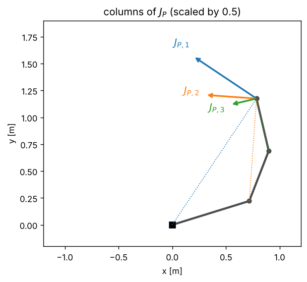

# 3 · The Jacobian

Forward kinematics maps joint positions to a pose. Control needs the map one level down: joint *velocities* to
end-effector *velocity*. That map is linear at each configuration, and its matrix is the Jacobian. Every
controller in the rest of the module is built from it. This chapter derives the **geometric Jacobian** column by
column, relates it to the space and body Jacobians of the product of exponentials, introduces the **analytic
Jacobian** of a minimal pose parametrisation, and shows how to check any Jacobian by finite differences.
Notation: [00_notation.md](00_notation.md).

## 3.1 Differential kinematics

The end-effector moves with linear velocity $\dot p_e$ and angular velocity $\omega_e$, both expressed in the base
frame. Because forward kinematics is smooth in $q$, these depend linearly on $\dot q$:

$$
\begin{bmatrix} \dot p_e \\ \omega_e \end{bmatrix} = J(q)\,\dot q =
\begin{bmatrix} J_P(q) \\ J_O(q) \end{bmatrix}\dot q, \qquad J(q) \in \mathbb{R}^{6\times n}. \tag{3.1}
$$

$J$ is the **geometric Jacobian**. Its $i$-th column is the end-effector velocity produced by a unit velocity of
joint $i$ with all other joints still. The top block is the derivative of $p_e(q)$; the bottom block is *not*
the derivative of any three numbers describing orientation, because angular velocity is not the derivative of
a vector of angles (section 3.4).

## 3.2 The geometric Jacobian, column by column

Move only joint $i$. Everything from link $i$ outwards then moves as one rigid body attached to joint $i$, whose
axis is $z_{i-1}$ through $o_{i-1}$ (DH rule 1, chapter 2).

- **Revolute joint.** The distal body rotates about $z_{i-1}$ with angular velocity $\dot q_i z_{i-1}$. A point
  of that body at $p_e$ moves with velocity $\dot q_i z_{i-1} \times (p_e - o_{i-1})$.
- **Prismatic joint.** The distal body translates along $z_{i-1}$ with speed $\dot q_i$ and does not rotate.

Velocities of a chain add (each joint's motion is relative to the previous link, and the motion of the previous
links is already accounted for by their own columns), so

$$
J_i = \begin{bmatrix} J_{P,i} \\ J_{O,i} \end{bmatrix} =
\begin{cases}
\begin{bmatrix} z_{i-1} \times (p_e - o_{i-1}) \\ z_{i-1} \end{bmatrix} & \text{revolute} \\[2ex]
\begin{bmatrix} z_{i-1} \\ 0 \end{bmatrix} & \text{prismatic}
\end{cases} \tag{3.2}
$$

and

$$
J(q) = \begin{bmatrix} J_1 & J_2 & \cdots & J_n \end{bmatrix}. \tag{3.3}
$$

Everything in (3.2) is read off the frames $T_0, \dots, T_{n}$ that forward kinematics already computed:
$z_{i-1}$ is the third column of $R_{i-1}$, $o_{i-1}$ and $p_e$ are translation columns. The Jacobian therefore
costs one forward-kinematics pass plus $n$ cross products.

**Jacobian of an intermediate frame.** Later chapters control points other than the end-effector (a link that
must avoid an obstacle, the elbow). The Jacobian of the origin of frame $\{k\}$ uses the same formula with $p_e$
replaced by $o_k$, and only joints $1, \dots, k$ move that frame:

$$
J^{(k)}_i = \begin{cases} \text{(3.2) with } p_e \to o_k & i \le k \\ 0 & i > k \end{cases}. \tag{3.4}
$$

### Worked example: the planar two-link arm

Both axes are $z_0 = (0,0,1)$, $o_0 = 0$, $o_1 = (l_1 c_1, l_1 s_1, 0)$, and $p_e$ is given by eq. (2.3). The cross
products $z \times (x, y, 0) = (-y, x, 0)$ give

$$
J = \begin{bmatrix}
-l_1 s_1 - l_2 s_{12} & -l_2 s_{12} \\
l_1 c_1 + l_2 c_{12} & l_2 c_{12} \\
0 & 0 \\ 0 & 0 \\ 0 & 0 \\
1 & 1
\end{bmatrix},
$$

the derivative of (2.3) in the top rows and the planar angular velocity $\dot q_1 + \dot q_2$ in the last. The unit
test `planar two-link Jacobian matches the closed form` checks this matrix.

*Figure 3.1 — Columns $J_{P,i}$ of a planar three-link arm, drawn at the end-effector: the velocity caused by a
unit speed of joint $i$. Each is perpendicular to the line from joint $i$ to the end-effector and proportional to
its length. Generated by `tools/make_figures.py`.*

## 3.3 Space and body Jacobians

With the product of exponentials (2.4), the natural velocity is the twist. Differentiating
$T = e^{[\mathcal{S}_1]q_1}\cdots e^{[\mathcal{S}_n]q_n}M$ and using (2.6) gives the **space twist**
$[\mathcal{V}_s] = \dot T T^{-1}$ as $\mathcal{V}_s = J_s(q)\dot q$ with [3, sec. 5.1]

$$
J_{s,1} = \mathcal{S}_1, \qquad
J_{s,i} = \mathrm{Ad}_{e^{[\mathcal{S}_1]q_1}\cdots e^{[\mathcal{S}_{i-1}]q_{i-1}}}\,\mathcal{S}_i. \tag{3.5}
$$

Column $i$ is the screw axis of joint $i$ *at the current configuration*. The **body twist**
$[\mathcal{V}_b] = T^{-1}\dot T$ is the same velocity in end-effector coordinates:

$$
J_b(q) = \mathrm{Ad}_{T^{-1}}\,J_s(q). \tag{3.6}
$$

The geometric Jacobian differs from $J_s$ only in which point's velocity it reports. The space twist's linear part
is the velocity of the body point passing through the base origin, $v_s = \dot p_e - \omega \times p_e$
(eq. 1.10). Solving for $\dot p_e$:

$$
J(q) = \begin{bmatrix} I & -[p_e]_\times \\ 0 & I \end{bmatrix} J_s(q). \tag{3.7}
$$

The tests check (3.7) against the DH construction for the PUMA 560 and the Stanford arm: the two derivations
are independent and must agree.

## 3.4 The analytic Jacobian

Sometimes the task is written in a minimal set of coordinates, for instance $x = (p_e, \phi, \vartheta, \psi)$ with
roll–pitch–yaw angles (eq. 1.7). The **analytic Jacobian** is the plain derivative $J_A = \partial x / \partial q$.
Its position rows equal $J_P$. For the angles, differentiate $R = R_z(\psi)R_y(\vartheta)R_x(\phi)$: each angle
rate contributes an angular velocity about its own (current) axis,

$$
\omega = \dot\psi\,z_0 + \dot\vartheta\,R_z(\psi)\,y_0 + \dot\phi\,R_z(\psi)R_y(\vartheta)\,x_0
= \underbrace{\begin{bmatrix}
c_\psi c_\vartheta & -s_\psi & 0 \\ s_\psi c_\vartheta & c_\psi & 0 \\ -s_\vartheta & 0 & 1
\end{bmatrix}}_{T(\phi,\vartheta,\psi)}
\begin{bmatrix}\dot\phi\\ \dot\vartheta \\ \dot\psi\end{bmatrix}, \tag{3.8}
$$

so

$$
J_A(q) = \begin{bmatrix} I & 0 \\ 0 & T^{-1} \end{bmatrix} J(q). \tag{3.9}
$$

$\det T = \cos\vartheta$: at $\vartheta = \pm\pi/2$ the analytic Jacobian does not exist even though the arm
itself may be far from any singularity. This is the gimbal lock of chapter 1, now as a **representation
singularity** of the Jacobian. Geometric and analytic Jacobians coincide in the position rows and differ in the
orientation rows; mixing them is a classic error.

## 3.5 Checking a Jacobian numerically

Any Jacobian can be checked against the function it differentiates. Central differences with step $h$:

$$
J_{P,i} \approx \frac{p_e(q + h e_i) - p_e(q - h e_i)}{2h}, \qquad
J_{O,i} \approx \frac{\log\!\big(R_e(q + h e_i)\,R_e(q - h e_i)^T\big)}{2h}. \tag{3.10}
$$

The orientation column uses the logarithm of chapter 1: $R(q + h e_i) R(q - h e_i)^T \approx \exp([\omega]_\times 2h)$
for the spatial angular velocity $\omega$ of a unit joint speed. The error of (3.10) has two parts: truncation,
proportional to $h^2$, and rounding, proportional to $\varepsilon / h$ with $\varepsilon \approx 10^{-16}$ the
machine precision. Their sum is smallest near $h \approx \varepsilon^{1/3}$, a few times $10^{-6}$; the chapter-3
notebook plots the V-shaped error curve. Forward differences ($[f(q + he_i) - f(q)]/h$) have $O(h)$ truncation and a
worse optimum.

## 3.6 Algorithms

**Geometric Jacobian of frame $k$** (`geometric_jacobian`, eqs. 3.2–3.4) — input frames $T_0, \dots, T_n, T_e$ and
joint types:

1. $p \leftarrow$ origin of frame $k$; $J \leftarrow 0_{6\times n}$.
2. For $i = 1, \dots, \min(k, n)$: read $z_{i-1}$, $o_{i-1}$ from $T_{i-1}$. If joint $i$ is revolute,
   $J_i \leftarrow (z_{i-1}\times(p - o_{i-1}),\ z_{i-1})$; if prismatic, $J_i \leftarrow (z_{i-1}, 0)$.

**Space Jacobian** (`space_jacobian`, eq. 3.5): $T \leftarrow I$; for $i = 1..n$: $J_{s,i} \leftarrow
\mathrm{Ad}_T\mathcal{S}_i$, then $T \leftarrow T e^{[\mathcal{S}_i]q_i}$.

**Numerical Jacobian** (`numerical_jacobian`, eq. 3.10): for each joint, evaluate forward kinematics at
$q \pm h e_i$ and apply (3.10).

## 3.7 Common mistakes

- **Using the end-effector origin for a link Jacobian.** The Jacobian of frame $k$ needs $o_k$ in the cross
  product of (3.2), not $p_e$. The error is invisible for $k = n$ and wrong for every other link; the notebook
  shows it.
- **Off-by-one in the axis.** Joint $i$ rotates about $z_{i-1}$, the axis of the *previous* frame.
- **Treating $J_O$ as the derivative of Euler angles.** It is not; finite differences of roll–pitch–yaw give the
  analytic Jacobian (3.9), not $J_O$.
- **Mixing the space twist with the end-effector velocity.** The linear part of $J_s\dot q$ is not $\dot p_e$; use
  (3.7).
- **Forgetting the base transform.** With the arm mounted at $T_0 \ne I$, the first axis is $z$ of $T_0$, not the
  world $z$.
- **Finite differences with a bad step.** $h = 10^{-10}$ is dominated by rounding, $h = 10^{-2}$ by truncation.

## References

1. D. E. Whitney, "Resolved motion rate control of manipulators and human prostheses", *IEEE Trans.
   Man-Machine Systems* 10(2):47–53, 1969.
2. B. Siciliano, L. Sciavicco, L. Villani, G. Oriolo, *Robotics: Modelling, Planning and Control*, Springer,
   2009, ch. 3.
3. K. M. Lynch, F. C. Park, *Modern Robotics*, Cambridge University Press, 2017, ch. 5.
4. D. E. Orin, W. W. Schrader, "Efficient computation of the Jacobian for robot manipulators", *Int. J. Robotics
   Research* 3(4):66–75, 1984.
5. J. Nocedal, S. J. Wright, *Numerical Optimization*, 2nd ed., Springer, 2006, sec. 8.1 (finite differences).
