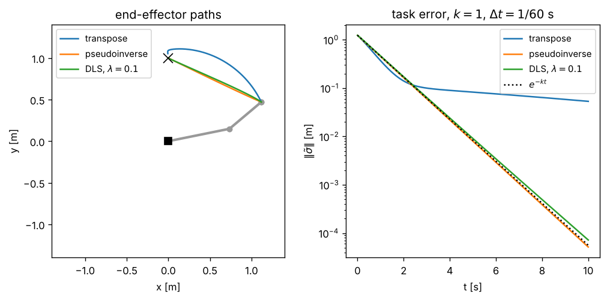

# 4 · Resolved-rate motion control

The Jacobian tells us which end-effector velocity a joint velocity produces. Resolved-rate motion control [1]
inverts that relation: at every control period it measures the task error, asks for a task velocity that reduces
it, and *resolves* that velocity into joint rates. This chapter derives the control law with the three classic
inverses — pseudoinverse, transpose and damped least squares — and answers the practical questions: how fast
does the error converge, how large may the gain be, and what happens when the target moves. Notation:
[00_notation.md](00_notation.md); Jacobians: [chapter 3](03_jacobian.md).

## 4.1 Kinematic control

Industrial arms accept joint *velocity* (or position) commands and track them with fast inner servo loops. If
those loops are much faster than the motion we ask for, the arm behaves like an integrator, $\dot q = u$, and we may
design $u$ from kinematics alone. This is **kinematic control**. It needs no dynamic model and runs at the rate of
a forward-kinematics call, which is why it is everywhere; its price is that it ignores torque limits and
dynamics, so commanded speeds and accelerations must stay within what the servos can deliver.

## 4.2 The control law

Let $\sigma(q) \in \mathbb{R}^m$ be the task variable — the end-effector position ($m = 3$), its planar part
($m = 2$), or the full pose ($m = 6$) — with Jacobian $J(q)$ (the corresponding rows of the geometric Jacobian):

$$
\dot\sigma = J(q)\,\dot q. \tag{4.1}
$$

Given a desired value $\sigma_d(t)$ define the **task error**

$$
\tilde\sigma = \sigma_d - \sigma. \tag{4.2}
$$

We want the error to obey $\dot{\tilde\sigma} = -K\tilde\sigma$ with a positive definite gain $K$, i.e. we want the
task velocity $\dot\sigma = \dot\sigma_d + K\tilde\sigma$. Resolving it through a generalised inverse $J^\#$ gives the
**resolved-rate control law**

$$
\dot q = J^\#(q)\,\big(\dot\sigma_d + K\tilde\sigma\big). \tag{4.3}
$$

$\dot\sigma_d$ is the **feedforward** term: it moves the arm with the reference; $K\tilde\sigma$ is the feedback
that removes the error. For a fixed target $\dot\sigma_d = 0$. Three choices of $J^\#$ follow.

## 4.3 Pseudoinverse

When $m \le n$ and $J$ has full row rank, $J\dot q = v$ has infinitely many solutions if $m < n$. The one of
smallest norm solves $\min \tfrac12\lVert\dot q\rVert^2$ subject to $J\dot q = v$. With a multiplier $\mu$, the
stationarity condition $\dot q = J^T\mu$ and the constraint give $\mu = (JJ^T)^{-1}v$, so
$\dot q = J^T(JJ^T)^{-1}v$. For any $J$ — square, tall, wide or rank deficient — the **Moore–Penrose
pseudoinverse** is defined through the singular value decomposition $J = U S V^T$:

$$
J^\dagger = V S^\dagger U^T, \qquad S^\dagger = \mathrm{diag}(1/s_1, \dots, 1/s_r, 0, \dots, 0), \tag{4.4}
$$

where $s_1 \ge \dots \ge s_r > 0$ are the non-zero singular values. $J^\dagger v$ is the minimum-norm solution
among the least-squares solutions of $J\dot q = v$; it reduces to $J^T(JJ^T)^{-1}$ for full row rank and to $J^{-1}$
for a square invertible $J$. In code, "non-zero" means larger than a tolerance relative to $s_1$.

**Closed loop.** Substitute (4.3) with $J^\# = J^\dagger$ into $\dot{\tilde\sigma} = \dot\sigma_d - J\dot q$. With full
row rank $JJ^\dagger = I$, so

$$
\dot{\tilde\sigma} = -K\tilde\sigma, \qquad \tilde\sigma(t) = e^{-Kt}\,\tilde\sigma(0). \tag{4.5}
$$

The error decays exponentially, each component with its own rate, *independently of the configuration* and
of the nonlinearity of $\sigma(q)$. With $K = kI$ the error keeps its direction, so the end-effector moves on a
straight line towards a fixed target. The tests check $\tilde\sigma(1\,\mathrm{s}) = e^{-k}\tilde\sigma(0)$ to
$10^{-3}$ relative accuracy.

**Damped least squares.** Near a singularity $1/s_r$ explodes, and so do the joint rates. The damped inverse

$$
J^\dagger_\lambda = J^T\big(JJ^T + \lambda^2 I\big)^{-1} \tag{4.6}
$$

trades a small task error for bounded joint rates. It is the subject of [chapter 5](05_singularities.md); here it
appears only as one of the three options.

## 4.4 Jacobian transpose

The transpose needs no inversion at all: $\dot q = J^T K\tilde\sigma$ [2]. For a fixed target and $K = kI$ take
$V = \tfrac12\tilde\sigma^T\tilde\sigma$:

$$
\dot V = -\tilde\sigma^T J\dot q = -k\,\tilde\sigma^T J J^T\tilde\sigma = -k\,\lVert J^T\tilde\sigma\rVert^2 \le 0. \tag{4.7}
$$

The error never grows: the transpose method is gradient descent on $\tfrac12\lVert\tilde\sigma\rVert^2$. Near a
configuration the error component along the left singular vector $u_i$ decays with rate $k s_i^2$, so convergence
is fast along well-conditioned directions and slow along poor ones, and the end-effector path is curved. $\dot V$
vanishes when $J^T\tilde\sigma = 0$ with $\tilde\sigma \ne 0$: at a singular configuration whose lost direction is
exactly the error, the method stalls.

*Figure 4.1 — A planar two-link arm ($l_1 = 0.75$ m, $l_2 = 0.5$ m) driven from $q = (0.2, 0.5)$ to the point
$(0, 1)$ with $k = 1$ and $\Delta t = 1/60$ s. The pseudoinverse follows the straight line and the error tracks
$e^{-kt}$; DLS is almost identical away from singularities; the transpose takes a curved path and slows down once
the remaining error lies along the weak singular direction. Generated by `tools/make_figures.py`.*

## 4.5 Tracking a moving target

For a moving reference, feedforward matters. With (4.3) and the pseudoinverse the error obeys (4.5) whatever
$\dot\sigma_d$ is. Drop the feedforward and the error obeys $\dot{\tilde\sigma} = \dot\sigma_d - K\tilde\sigma$; for a
constant reference velocity it settles at the **tracking lag**

$$
\tilde\sigma_{ss} = K^{-1}\dot\sigma_d. \tag{4.8}
$$

A higher gain shrinks the lag but, as the next section shows, the gain cannot be raised freely.

## 4.6 Discrete time and the gain limit

A controller runs at a period $\Delta t$ and the arm integrates $q_{k+1} = q_k + \Delta t\,\dot q_k$. Near the
target, linearise $\sigma(q_{k+1}) \approx \sigma(q_k) + J\Delta t\,\dot q_k$. With the pseudoinverse and $K = kI$:

$$
\tilde\sigma_{k+1} = (1 - k\Delta t)\,\tilde\sigma_k. \tag{4.9}
$$

The error shrinks monotonically for $0 < k\Delta t \le 1$ (at $k\Delta t = 1$ in one step, in the linear
regime), oscillates with decreasing amplitude for $1 < k\Delta t < 2$, and diverges for $k\Delta t > 2$. For the
transpose the factor along $u_i$ is $1 - k\Delta t\,s_i^2$, so the limit is $k < 2/(\Delta t\,s_1^2)$, which depends on
the configuration. In practice, latency and speed limits call for $k\Delta t$ well below one. The tests check
(4.9) for $k\Delta t \in \{0.5, 1, 1.5, 2.5\}$.

## 4.7 Orientation error

A full-pose task needs an orientation error. Differences of Euler angles are a poor choice (they inherit the
representation singularity of chapter 1). The **axis–angle error** is

$$
e_O = \log\big(R_d R^T\big) \in \mathbb{R}^3: \tag{4.10}
$$

the rotation, expressed in the base frame, that carries the current orientation $R$ onto $R_d$ [3, sec. 3.7.3].
It is paired with the angular-velocity rows $J_O$ of the geometric Jacobian. For a constant $R_d$, writing
$R_dR^T = \exp([e_O]_\times)$ and differentiating gives $\dot e_O = -J_r^{-1}(e_O)\,\omega$ with the right Jacobian of
$SO(3)$ [4], $J_r^{-1}(e) = I + \tfrac12[e]_\times + c(\lVert e\rVert)[e]_\times^2$. Under pseudoinverse control
$\omega = k e_O$, and since $[e]_\times e = 0$ every term but the identity drops out:

$$
\dot e_O = -k\,e_O.
$$

The axis–angle error therefore decays exactly like the position error, along a fixed axis, for any initial angle
below $\pi$. The tests check that the full six-dimensional pose error of the PUMA 560 decays as $e^{-kt}$.

Position (metres) and orientation (radians) errors have different units; a single scalar gain treats 1 rad
like 1 m. Use a block-diagonal $K$ when the two should converge at different rates.

## 4.8 Algorithm

**Resolved-rate control** (`resolved_rate_step`, `simulate_resolved_rate`, eq. 4.3) — at each period $k$:

1. Forward kinematics: $T_e(q_k)$ and the frames.
2. Task error $\tilde\sigma_k$: position difference, and $\log(R_dR^T)$ for orientation (4.2, 4.10).
3. Task Jacobian $J$: the matching rows of the geometric Jacobian (3.3).
4. $\dot q_k = J^\#(\dot\sigma_d + K\tilde\sigma_k)$ with $J^\# \in \{J^T, J^\dagger, J^\dagger_\lambda\}$ (4.3).
5. Optionally scale $\dot q_k$ down uniformly so that no joint exceeds its speed limit (the direction of motion
   is preserved).
6. Send $\dot q_k$; in simulation $q_{k+1} = q_k + \Delta t\,\dot q_k$.

## 4.9 Common mistakes

- **Error with the wrong sign.** $\tilde\sigma = \sigma - \sigma_d$ in (4.3) drives the arm *away* from the target,
  exponentially.
- **Gain chosen without the period.** It is $k\Delta t$ that matters (4.9); a gain tuned at 1 kHz can be unstable at
  60 Hz.
- **Forgetting the feedforward** when tracking: the arm lags by $K^{-1}\dot\sigma_d$ (4.8).
- **Orientation error as a difference of Euler angles,** or as $\log(R^TR_d)$ (that one is in the end-effector
  frame and must be paired with the body Jacobian, not with $J_O$).
- **Clipping each joint separately** to its speed limit. It changes the direction of $\dot q$ and therefore the
  end-effector path; scale the whole vector instead.
- **Inverting $JJ^T$ near a singularity** with the plain pseudoinverse — see chapter 5.

## References

1. D. E. Whitney, "Resolved motion rate control of manipulators and human prostheses", *IEEE Trans.
   Man-Machine Systems* 10(2):47–53, 1969.
2. W. A. Wolovich, H. Elliott, "A computational technique for inverse kinematics", *Proc. 23rd IEEE Conf. on
   Decision and Control*, 1984, pp. 1359–1363.
3. B. Siciliano, L. Sciavicco, L. Villani, G. Oriolo, *Robotics: Modelling, Planning and Control*, Springer,
   2009, sec. 3.5–3.7.
4. J. Solà, J. Deray, D. Atchuthan, *A micro Lie theory for state estimation in robotics*, arXiv:1812.01537,
   2018 (right Jacobian of SO(3)).
5. R. Penrose, "A generalized inverse for matrices", *Proc. Cambridge Philosophical Society* 51:406–413, 1955.
6. S. R. Buss, *Introduction to inverse kinematics with Jacobian transpose, pseudoinverse and damped least squares
   methods*, technical report, University of California San Diego, 2004.
