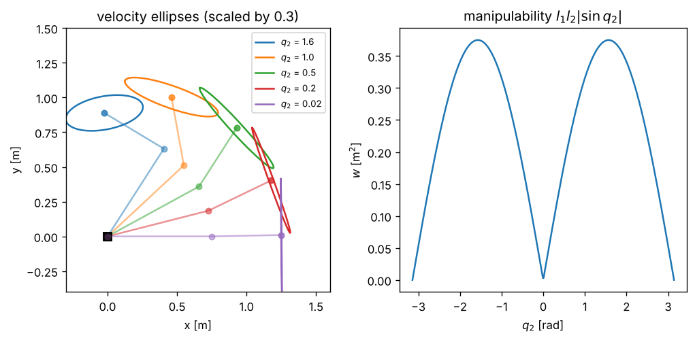
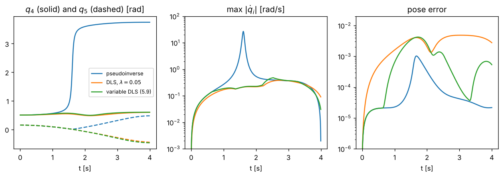

# 5 · Singularities

At some configurations the Jacobian loses rank: the end-effector cannot move in some direction, however the
joints move. Exactly at such a **singularity** the pseudoinverse of chapter 4 throws that direction away; *near*
it, the pseudoinverse asks for enormous joint rates to produce small task velocities. This chapter measures how
close a configuration is to singular (singular values, the velocity ellipsoid, manipulability), derives the
**damped least-squares** inverse that keeps joint rates bounded, and shows how to damp only where it is needed.
Notation: [00_notation.md](00_notation.md); control law: [chapter 4](04_resolved_rate_control.md).

## 5.1 What goes wrong

Write the SVD of the $m\times n$ task Jacobian as $J = \sum_{i=1}^{m} s_i\,u_i v_i^T$ with orthonormal left
singular vectors $u_i \in \mathbb{R}^m$ (task directions), right singular vectors $v_i \in \mathbb{R}^n$ (joint
directions) and $s_1 \ge \dots \ge s_m \ge 0$. A joint velocity along $v_i$ moves the task along $u_i$ with gain
$s_i$. The pseudoinverse inverts every gain:

$$
\dot q = J^\dagger\dot\sigma = \sum_{i:\,s_i > 0} \frac{1}{s_i}\,v_i\,(u_i^T\dot\sigma).
$$

When $s_m \to 0$ the task direction $u_m$ becomes unreachable, and any component of $\dot\sigma$ along it is
amplified by $1/s_m$. In discrete time this shows up as joint-rate spikes, and, when the commanded rates are
integrated over a period, as wild jumps of the configuration.

Singularities come in two kinds [2, sec. 3.3]. **Boundary singularities** occur when the arm is fully stretched
or folded: the end-effector is on the boundary of the workspace and cannot move outwards. **Internal
singularities** occur inside the workspace when joint axes line up. For the planar two-link arm both kinds are
the same condition, $\sin q_2 = 0$. For the PUMA 560 the **wrist singularity** $q_5 = 0$ aligns the axes of joints
4 and 6: rotating one while counter-rotating the other leaves the hand still, so one hand rotation is lost. A
straight-line Cartesian path that passes near it makes the pseudoinverse spin joints 4 and 6 by about $\pi$ in a
fraction of a second — the "wrist flip" of section 5.3.

## 5.2 Measuring the distance to a singularity

The **velocity ellipsoid** is the set of task velocities reachable with unit-norm joint velocities [1]:

$$
\mathcal{E} = \{\,J\dot q : \lVert\dot q\rVert \le 1\,\}, \qquad \text{principal semi-axes } s_i\,u_i. \tag{5.1}
$$

A round ellipsoid means the arm moves equally well in every direction; a flat one means it is close to losing a
direction. Two scalar measures summarise it: the **manipulability** of Yoshikawa [1], proportional to the
ellipsoid's volume,

$$
w(q) = \sqrt{\det\big(J(q)J(q)^T\big)} = s_1 s_2\cdots s_m, \tag{5.2}
$$

and the **condition number** $\kappa = s_1/s_m$. Both detect singularities ($w = 0$, $\kappa = \infty$); $s_m$ itself is
the most direct measure of how close the worst direction is to being lost.

**Worked example.** For the planar two-link arm the $2\times 2$ Jacobian of section 3.2 has
$\det J = l_1 l_2 \sin q_2$ (expand and use $s_{12}c_1 - c_{12}s_1 = \sin q_2$), so

$$
w = l_1 l_2\,\lvert\sin q_2\rvert. \tag{5.3}
$$

It is zero when the arm is stretched or folded and largest at $q_2 = \pm\pi/2$, independently of $q_1$ and of where
the end-effector is. The unit test `planar two-link manipulability is l1 l2 |sin q2|` checks (5.3).

> **Units.** For a six-dimensional task, $J$ mixes metres and radians. Rescaling the task rows by a diagonal $S$
> (millimetres instead of metres) multiplies $w$ by the constant $|\det S|$, so comparisons of $w$ between
> configurations survive; but the shape of the ellipsoid, $s_m$ and $\kappa$ change configuration by configuration.
> With mixed revolute and prismatic joints the columns have different units too, and for a redundant arm even
> comparisons of $w$ then depend on the units chosen [4]. Scale rows and columns to a common reference before
> comparing.

*Figure 5.1 — Left: velocity ellipses (5.1) of the planar two-link arm ($l_1 = 0.75$ m, $l_2 = 0.5$ m) at several
configurations, scaled by 0.3; they collapse to a segment as $q_2 \to 0$. Right: manipulability (5.3) against $q_2$.
Generated by `tools/make_figures.py`.*

## 5.3 Damped least squares

Instead of solving $J\dot q = v$ exactly, minimise a compromise between task accuracy and joint speed
[5, 6]:

$$
\min_{\dot q}\;\lVert J\dot q - v\rVert^2 + \lambda^2\lVert\dot q\rVert^2
\quad\Longrightarrow\quad
(J^TJ + \lambda^2 I)\,\dot q = J^Tv
\quad\Longrightarrow\quad
\dot q = J^T(JJ^T + \lambda^2 I)^{-1}v = J^\dagger_\lambda v. \tag{5.4}
$$

The last step uses $(J^TJ + \lambda^2 I)J^T = J^T(JJ^T + \lambda^2 I)$; it replaces an $n\times n$ inverse by an
$m\times m$ one. For $\lambda > 0$ the matrix $JJ^T + \lambda^2 I$ is positive definite at *every* configuration,
singular or not. In terms of the SVD,

$$
J^\dagger_\lambda = \sum_{i=1}^{m} \frac{s_i}{s_i^2 + \lambda^2}\,v_i u_i^T. \tag{5.5}
$$

Compare with $1/s_i$: for $s_i \gg \lambda$ the two coincide; for $s_i \ll \lambda$ the gain $s_i/\lambda^2$ goes to zero
instead of infinity. The function $s/(s^2 + \lambda^2)$ peaks at $s = \lambda$ with value $1/(2\lambda)$, which gives a
configuration-independent bound

$$
\lVert J^\dagger_\lambda v\rVert \le \frac{\lVert v\rVert}{2\lambda}. \tag{5.6}
$$

**The price.** The closed loop of chapter 4 becomes, with $K = kI$ and a fixed target,

$$
\dot{\tilde\sigma} = -k\,JJ^\dagger_\lambda\tilde\sigma = -k\sum_i \frac{s_i^2}{s_i^2 + \lambda^2}\,u_i\,(u_i^T\tilde\sigma). \tag{5.7}
$$

Every direction still converges while $s_i > 0$, but more slowly, at rate $k s_i^2/(s_i^2 + \lambda^2)$; along a lost
direction ($s_i = 0$) the error simply stays — which is what we want when the target is unreachable. With a moving
reference the slower directions show up as a tracking error. The tests check, for an unreachable target, that DLS
joint rates obey (5.6) while the pseudoinverse exceeds the same bound tenfold, and that along a straight line
through the PUMA wrist singularity the pseudoinverse turns joint 4 by about $\pi$ with rates above 10 rad/s, whereas
DLS ($\lambda = 0.05$) passes through $q_5 = 0$ — $q_5$ changes sign instead — with rates below 1 rad/s and a task
error below 1 cm.

*Figure 5.2 — The PUMA 560 tracks a 15 cm straight line, at constant orientation, chosen to drive $q_5$ through zero
($k = 5$, $\Delta t = 5$ ms). Pseudoinverse: joint 4 flips by about $\pi$ near the singularity, with a spike in the
joint rates. DLS: no flip, a small temporary error, and a residual error at the end because constant damping also
slows convergence away from the singularity. Variable damping (5.9, $\varepsilon = 0.05$) keeps the rates bounded
and removes most of that residual. Generated by `tools/make_figures.py`.*

## 5.4 Variable damping

A constant $\lambda$ costs accuracy everywhere, including far from singularities where none is needed. Variable
damping switches it on only near a singularity, continuously so that the joint rates do not jump. Two classic
schedules:

- based on manipulability, with threshold $w_0$ (Nakamura and Hanafusa [5]):

$$
\lambda = \begin{cases} \lambda_{\max}\,(1 - w/w_0)^2 & w < w_0 \\ 0 & w \ge w_0 \end{cases} \tag{5.8}
$$

- based on the smallest singular value, with threshold $\varepsilon$ (Maciejewski and Klein [7], Chiaverini [8]):

$$
\lambda^2 = \begin{cases} \big(1 - (s_m/\varepsilon)^2\big)\,\lambda_{\max}^2 & s_m < \varepsilon \\ 0 & s_m \ge \varepsilon \end{cases} \tag{5.9}
$$

Both give the exact pseudoinverse away from singularities and $\lambda_{\max}$ at a singularity. (5.9) reacts to the
direction that is actually being lost; (5.8) is cheaper (a determinant instead of an SVD) but can be fooled when
one singular value is small and another large. A refinement, *selectively damped least squares* [9], damps each
singular direction separately.

## 5.5 Algorithm

**Resolved-rate step with variable damping** (`resolved_rate_step` with `InverseMethod::DampedLeastSquares`):

1. Compute the task error $\tilde\sigma$ and task Jacobian $J$ (chapter 4).
2. Compute $\lambda$: constant, (5.8) from $w = \sqrt{\det(JJ^T)}$, or (5.9) from the smallest singular value.
3. Solve $(JJ^T + \lambda^2 I)\,y = \dot\sigma_d + K\tilde\sigma$ by Cholesky ($LDL^T$) factorisation, then set
   $\dot q = J^Ty$ (5.4). No explicit inverse is formed.

## 5.6 Common mistakes

- **Inverting $JJ^T$ near a singularity** with a plain matrix inverse, or computing the pseudoinverse with a
  tolerance so small that $1/s_m$ is still applied.
- **Testing $\det J$ for a non-square Jacobian.** Use $s_m$ or $\sqrt{\det(JJ^T)}$.
- **Choosing $\lambda$ without thinking about units.** $\lambda$ has the units of a singular value (m/rad for a
  position task); a value that is small for metres is large for millimetres.
- **Switching damping on and off abruptly.** A discontinuous $\lambda$ makes $\dot q$ jump; use a continuous schedule.
- **Too much damping.** The arm becomes sluggish everywhere and lags moving targets (5.7).
- **Believing singularities only live at the workspace boundary.** Wrist and shoulder singularities are deep inside
  the workspace.

## References

1. T. Yoshikawa, "Manipulability of robotic mechanisms", *Int. J. Robotics Research* 4(2):3–9, 1985.
2. B. Siciliano, L. Sciavicco, L. Villani, G. Oriolo, *Robotics: Modelling, Planning and Control*, Springer,
   2009, sec. 3.3 and 3.9.
3. K. M. Lynch, F. C. Park, *Modern Robotics*, Cambridge University Press, 2017, sec. 5.3–5.4.
4. K. L. Doty, C. Melchiorri, C. Bonivento, "A theory of generalized inverses applied to robotics", *Int. J.
   Robotics Research* 12(1):1–19, 1993.
5. Y. Nakamura, H. Hanafusa, "Inverse kinematic solutions with singularity robustness for robot manipulator
   control", *ASME J. Dynamic Systems, Measurement, and Control* 108(3):163–171, 1986.
6. C. W. Wampler, "Manipulator inverse kinematic solutions based on vector formulations and damped least-squares
   methods", *IEEE Trans. Systems, Man, and Cybernetics* 16(1):93–101, 1986.
7. A. A. Maciejewski, C. A. Klein, "Numerical filtering for the operation of robotic manipulators through
   kinematically singular configurations", *J. Robotic Systems* 5(6):527–552, 1988.
8. S. Chiaverini, "Singularity-robust task-priority redundancy resolution for real-time kinematic control of
   robot manipulators", *IEEE Trans. Robotics and Automation* 13(3):398–410, 1997.
9. S. R. Buss, J.-S. Kim, "Selectively damped least squares for inverse kinematics", *J. Graphics Tools*
   10(3):37–49, 2005.
